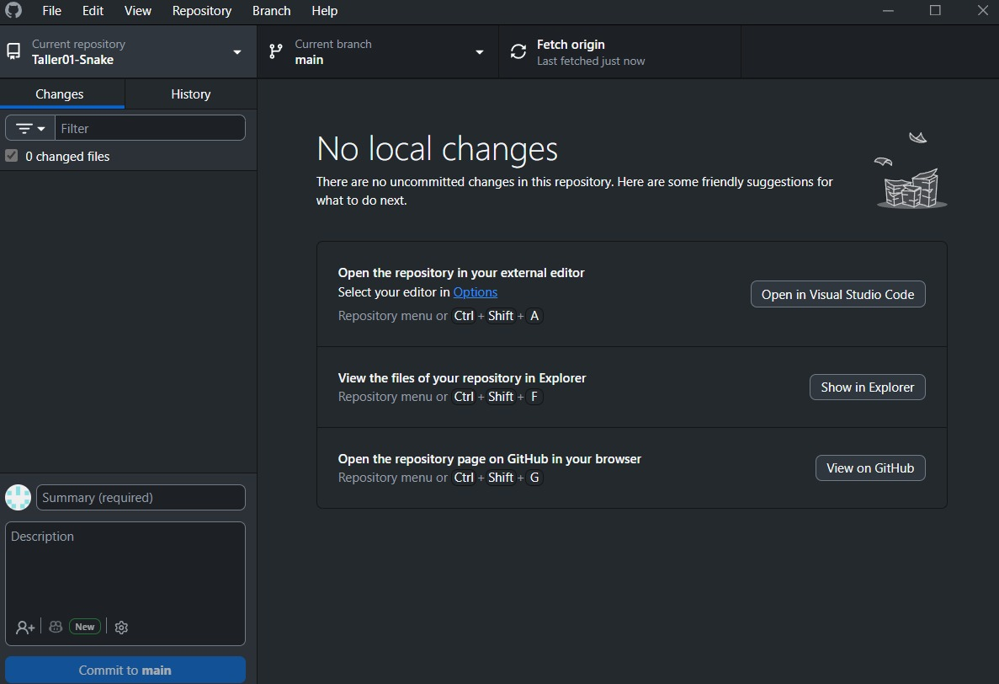
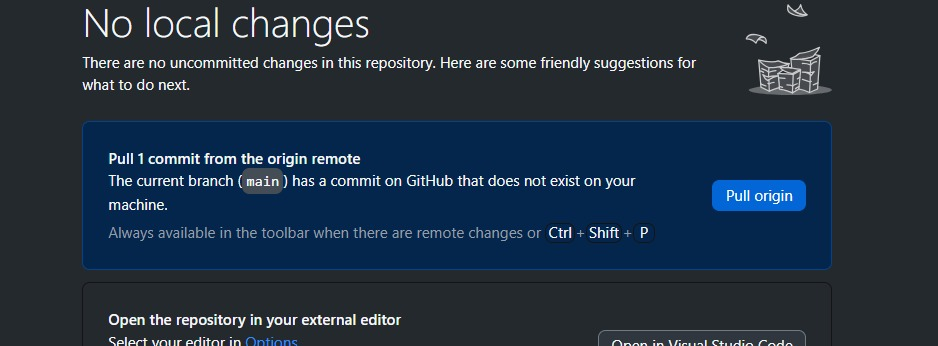
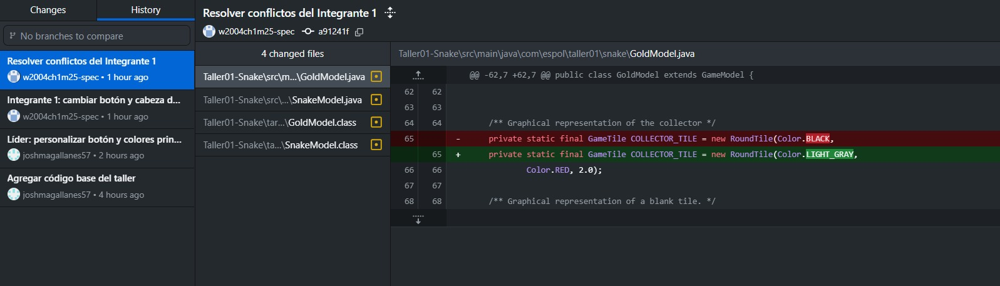
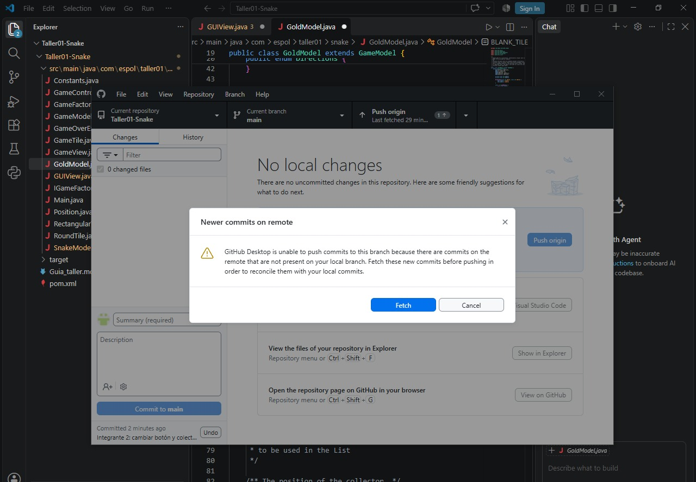
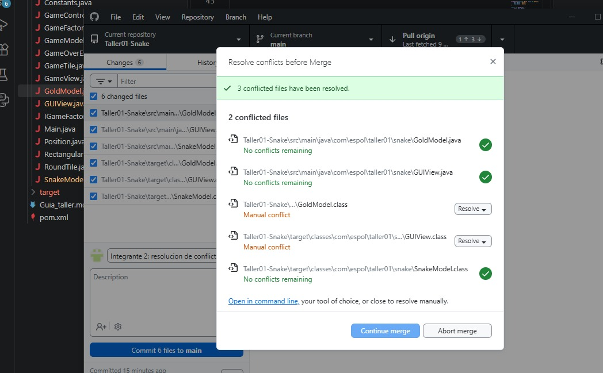

# Taller 01 - Git y Resolucion de Conflictos

## Integrantes y roles

| Rol | Nombre | Usuario de GitHub | Commit principal |
| Lider | Joshua Magallanes | joshmagallanes57 | personalizar boton y colores principales |
| Integrante 1 | Wilson Chang| w2004ch1m25-spec | cambiar boton y cabeza de snake |
| Integrante 2 | Jackson Hidalgo | chesterMoti | cambiar boton y colector de gold |

## Evidencias

### Lider

Push exitoso:

### Integrante 1

Error antes de resolver conflicto:

Push exitoso despues de resolver conflicto:

### Integrante 2

Error antes de resolver conflicto:

Push exitoso despues de resolver conflicto:

